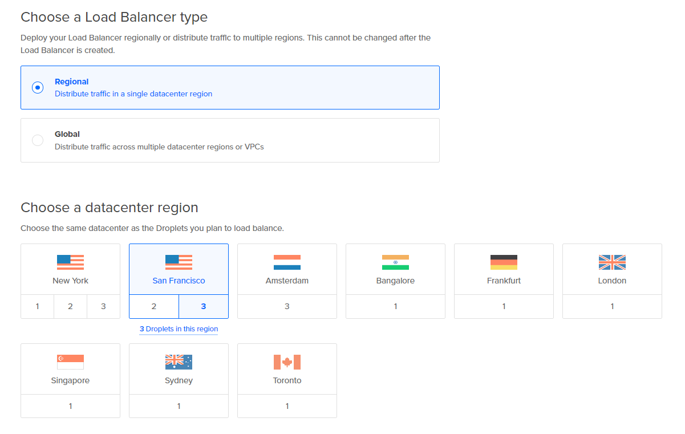

# 2420 Assignment 3 - Part 2

This is step-by-step process to set up a load balancer for two web servers.

Requirements:

1. Digital Ocean Account
2. Arch Linux droplets
3. Text editor (nvim, vim, nano)

## Create two new droplets on your Digital Ocean Account.

If you need help setting up the Digital Ocean droplet and setting the SSH authentication on you droplets you may see this tutorial first [Setting up a Arch Linux web server on Digital Ocean](https://github.com/yovitsa/2420_assignment_1)

### Additional to the tutorial from the link, for this tutorial assign these attributes to your droplets:

- Region: Choose the geographically closest to your location
- Insure that you create 2 droplets
- Assign name to your droplets
- Assign the tag **web** to both droplets.

## Create a load balancer on your Digital Ocean account.

Start by creating a load balancer using the Create button at the top of the control panel. Alternatively, use the Create load balancer button on the Load Balancers overview page.

On the creation page, you:

Click on Regional for the load balancer type.
Choose a datacenter region, your load balancer and its backend Droplets need to be in the same datacenter.

Keep the VPC network as default network for the datacenter region. 

Choose the load balancer’s Scaling configuration.
The load balancer’s scaling configuration allows you to adjust the load balancer’s number of nodes.
You can leave the default setting, ensure that the number of droplets is two.

Connect Droplets to the load balancer.
Use the Search for Droplet or a tag search bar to add Droplets to your load balancer.
You can use one tag per load balancer.
Type web in the search field.

Forwarding rules define how traffic is routed from the load balancer to its backend Droplets. You need at least one rule.

The default route is HTTP port 80 on the load balancer to HTTP port 80 on the backend Droplets.

Finalize and create, which includes Choose a name and Select project. Load balancer names must be unique and contain alphanumeric characters, dashes, and periods only. You can rename load balancers at any time after creation by clicking on the existing name on the load balancer page.

Leave the advanced settings as they are. Do not change anything.

Once you have created a  load balancer, you can view and manage them on the load balancer index page.
Please note that it might take a few minutes for a load balancer to be created.

Check Load Balancer Status
To check the status of your load balancer from the DigitalOcean Control Panel, click Networking, then click the Load Balancers tab. The page lists the load balancers set up in your account. Click your target Droplet’s load balancer.

## Step 3

Copy the content from the file to your `generate-index` file from this repository `generate-index` file.

## Step 4

### **The step below you will have to repeat in both of your droplets**

Run the user script
The `user` script will create all the necessary base directories and files for the new `webgen` user. 

**Please note that you have to have root privileges in order to run the user script**

Run the following command:

    sudo ./user 

Copy the content from the file to your `generate-index` file from this repository `generate-index` file.

### Generate Index service and timer

In Step 2 you have to create and configure `generate-index.service` and `generate-index.timer` 

1. `generate-index.service` will run your generate-index file.
 
`generate-index.service` needs to be created at the location below

    /etc/systemd/system/

Create the file by running the command below.

    sudo nvim /etc/systemd/system/generate-index.service

Change permissions on your newly created file.

    sudo chmod +x generate-index.service

You need to configure your `generate-index.service`

Copy the code below into your `generate-index.service` file.
      

    [Unit]
    Description=generate-index html

    [Service]
    User=webgen
    Group=webgen

    #Specify the file path of the script to execute when the service starts
    ExecStart=/var/lib/webgen/bin/generate_index

    #Service stays active state even after the main process has completed.
    RemainAfterExit=yes

    #Automatically restarts the service if it exits with a failure
    Restart=on-failure

    [Install]
    # Service starts during system boot and access the non-graphic multi-user mode
    WantedBy=multi-user.target
    

2. `generate-index.timer` will start your service every day at 05:00

`generate-index.timer` needs to be created at the location below

    /etc/systemd/system/

Create the file by running the command below.

    sudo nvim /etc/systemd/system/generate-index.timer

Change permissions on your newly created file.

    sudo chmod +x generate-index.timer

You need to configure your `generate-index.timer`

Copy the code below to you `generate-index.timer` file.

    [Unit]
    Description=Timer for generate-index.service

    [Timer]
    OnCalendar=*-*-* 05:00:00
    Persistent=True

    [Install]
    # Timer starts when the system is initialized and the timers group is activated.
    WantedBy=timers.target

Run the following commands to start and enable the services:

    sudo systemctl start generate-index.service
    sudo systemctl enable generate-index.service

    sudo systemctl start generate-index.timer
    sudo systemctl enable generate-index.timer

Check the status of your services by running the commands below:

    sudo systemctl status generate-index.timer
    sudo systemctl status generate-index.service

   
If everything went well, your output when running the status for `generate-index.service` should look similar to the image below

In the case that your services are not starting run the command below to reload the services. 
Also if you are making any changes to your service files. run the command below. 
      
    sudo systemctl daemon-reload

After running this command run the start / enable command services again.

### Install and configure  nginx

1. **Install nginx**

Run the command below to update your Arch linux distribution, you want to have most recent version.

    sudo pacman -Syu

Run the command below to install the nginx package

    sudo pacman -S nginx

2. **Modify the Main `nginx.conf` File**:

Update the `nginx.conf` file, so nginx server runs as the `webgen` user.

At the top of the `nginx.conf` file write the following statement 
     
     user webgen;
     

In the server block code of your `nginx.conf` file replace the following code:

    location / {
      root /usr/share/nginx/html;
      index index.html index.htm;
    }

Replace the code above with code below:

    location / {
      root /var/lib/webgen/HTML;
      index index.html index.html;
    }

Save the file and exit. 
Do not make any other changes to the `nginx.conf`.

2. **Create a Separate Server Block File**:

We will create a separate server block file.

We need to create two new directories.

The new directories need to be created in the directory below.

    cd /etc/nginx

Create two new directories by running the command below.

    sudo mkdir -p /etc/nginx/sites-available
    sudo mkdir -p /etc/nginx/sites-enabled

Create a new server block file in `/etc/nginx/sites-available/`

Create a new the file called `webgen.conf`.

Change permissions on your newly created file.

    sudo chmod +x `webgen.conf`

Copy the code below
     
   
    server {
    listen 80;
    server_name <your-droplet-ip>;

    # Root directory for the file server
    location /documents {
        root /var/lib/webgen;
        autoindex on;                # Enables the directory listing
        autoindex_exact_size off;    # Shows file sizes, human-readable
        autoindex_localtime on;      # Displays file timestamps
    }

    # Default location for other requests (optional)
    location / {
        root /var/lib/webgen/HTML;
        index index.html;
    }
}

Save and exit the file.

Append include sites-enabled/*; to the end of the http block in the `nginx.conf` file:

    /etc/nginx/nginx.conf
    http {
        ...
        include /etc/nginx/sites-enabled/*;
    }

Save the `nginx.conf` file and exit, do not change anything else.

     
To enable a site, create a symlink by running the command below:

    ln -s /etc/nginx/sites-available/webgen.conf /etc/nginx/sites-enabled/webgen.conf

4. **Troubleshoot nginx configuration**:

  Check the `nginx.conf` file for any syntax errors:

Run the command below:
     
     sudo nginx -t
     
Run the command below to start and enable nginx services

    sudo systemctl daemon-reload
    sudo systemctl start nginx.service
    sudo systemctl enable nginx.service  

Test your web pages by typing your ip addresses in your browser.
Your output should look similar to the below.

## Step 5

### Test your load balancer

It is time to test your load balancer.
Enter the load balancer IP address in your browser
You can see the load balancer IP address in your Digital Ocean acount.

Your output should be similar to the image below.
Refresh the page (you may need to do this a couple of times) and if everything went well your IP address should change.
That means that load balancer is working properly

## Step 6
### Test your file server

Enter `<your-ip-address/documents>` in your browser. 

Use your any of the ip addresses, but to test your load balancer use the load balancer ip.

Your output should be similiar to the image below, refresh the page a few times and you you server will change.

Click on the `file_one` or `file_two` and the file will be downloaded.

Your browser might show warnings that the file is insecure, you may ignore that and go ahead and downlaod the file.

## Troubleshoot and possible issues

Issue 1: Apache Conflicts with nginx
When setting up nginx, I ran into a problem where Apache server was running on my system was using port 80. 
This caused a conflict because nginx also needed port 80.
Solution to this situation is to stop all apache servers and disabled them so that port 80 is free for nginx.

To figure out which processes were using port 80, I installed the `lsof` tool. 
This tool showed me all the running services and their port usage.

Run the command below to stop and after disable the apache server or some other server

    sudo systemctl stop httpd

    sudo systemctl disable httpd

Run the command below to check that apache is no longer using the port 80.

    lsof -i :80

Issue 2: iptables  Error
While trying to set up UFW (Uncomplicated Firewall), I got this warning:
iptables v1.8.10 (legacy): can't initialize iptables table 'filter': Table does not exist (do you need to insmod?).

The problem was caused by an outdated kernel or missing modules needed for iptables. I also found that the iptables.service was inactive. To fix this, I updated my Arch Linux server and rebooted it. After the update and reboot, iptables was working, and I was able to configure UFW without any issues

To update the arch server run the command below.

    sudo pacman -Syu

To reboot your server, run the command below

    sudo systemctl reboot

# Reference
  
  
  1. `nginx` https://wiki.archlinux.org/title/Nginx 3.2.3.1 

  2. `lsof`
  https://www.liquidweb.com/blog/how-to-locate-open-ports-in-linux/#:~:text=The%20six%20primary%20methods%20for,re%20correctly%20configured%20and%20secure.

  3. `ufw`
  https://wiki.archlinux.org/title/Uncomplicated_Firewall

  4. `timer`
  https://wiki.archlinux.org/title/Systemd/Timers

  5. `Load balancer troublushoot`
  https://www.digitalocean.com/community/questions/how-to-troubleshoot-2-droplets-with-load-balancer

